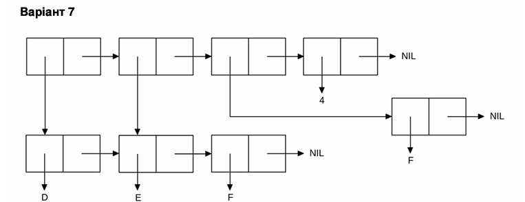

<p align="center"><b>МОНУ НТУУ КПІ ім. Ігоря Сікорського ФПМ СПіСКС</b></p>
<p align="center">
<b>Звіт з лабораторної роботи 1</b><br/>
"Обробка списків з використанням базових функцій"<br/>
дисципліни "Вступ до функціонального програмування"
</p>
<p align="right"><b>Студент</b>: Кузнецов Дмитро Сергійович КВ-21</p>
<p align="right"><b>Рік</b>: 2025</p>

## Загальне завдання

### Пункт 1
```lisp
;; Оголошуємо список

(defvar my-list nil)

(setq my-list
      (list 'x
            7
            (list 'y 'z)
            nil
            (cons 100 '(200))))


(format t "1.  List: ~a~%" my-list)

1.  List: (X 7 (Y Z) NIL (100 200))
```
### Пункт 2
```lisp
;; Голова списку
(format t "2.  Head: ~a~%" (car my-list))

2.  Head: X
 ```
### Пункт 3
```lisp
;; Хвіст списку
(format t "3.  Tail: ~a~%" (cdr my-list))

3.  Tail: (7 (Y Z) NIL (100 200))
```
### Пункт 4
```lisp
;; Третій елемент
(format t "4.  3d element: ~a~%" (third my-list))

4.  3d element: (Y Z)
```
### Пункт 5
```lisp
;; Останній елемент
(format t "5.  Last element: ~a~%" (car (last my-list)))

5.  Last element: (100 200)
```
### Пункт 6
```lisp
;; ATOM
;; Голова списку
(format t "6.1 ATOM head: ~a~%" (atom (car my-list)))

;; Другий елемент списку
(format t "6.2 ATOM 2d: ~a~%" (atom (second my-list)))

;; Третій елемент списку
(format t "6.3 ATOM 3d: ~a~%" (atom (third my-list)))


;; LISTP
;; Другий елемент списку
(format t "6.4 LISTP 2d: ~a~%" (listp (second my-list)))

;; Третій елемент списку
(format t "6.5 LISTP 3d: ~a~%" (listp (third my-list)))

;; Четвертий елемент списку
(format t "6.6 LISTP 4th: ~a~%" (listp (fourth my-list)))

6.1 ATOM head: T
6.2 ATOM 2d: T
6.3 ATOM 3d: NIL
6.4 LISTP 2d: NIL
6.5 LISTP 3d: T
6.6 LISTP 4th: T
```
### Пункт 7
```lisp
;; NULL
(format t "7.1 NULL 4th: ~a~%" (null (fourth my-list)))

;; NUMBERP
(format t "7.2 NUMBERP 2d: ~a~%" (numberp (second my-list)))

;; SYMBOLP
(format t "7.3 SYMBOLP car: ~a~%" (symbolp (car my-list)))

7.1 NULL 4th: T
7.2 NUMBERP 2d: T
7.3 SYMBOLP car: T
```
### Пункт 8
```lisp
;; Append
(format t "8.  Append list: ~a~%" (append my-list (third my-list)))

8.  Append list: (X 7 (Y Z) NIL (100 200) Y Z)
```
## Варіант 7
<p align="center">

</p>

```lisp
(defvar y nil)

(setq y
      (let ((x (list 'd 'e 'f)))
        (list x (cdr x) (list 'f) 4)))

(format t "Variant 7: ~a~%" y)

Варіант 7: ((D E F) (E F) (F) 4)
```
